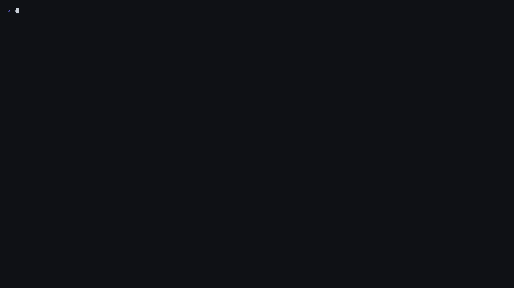
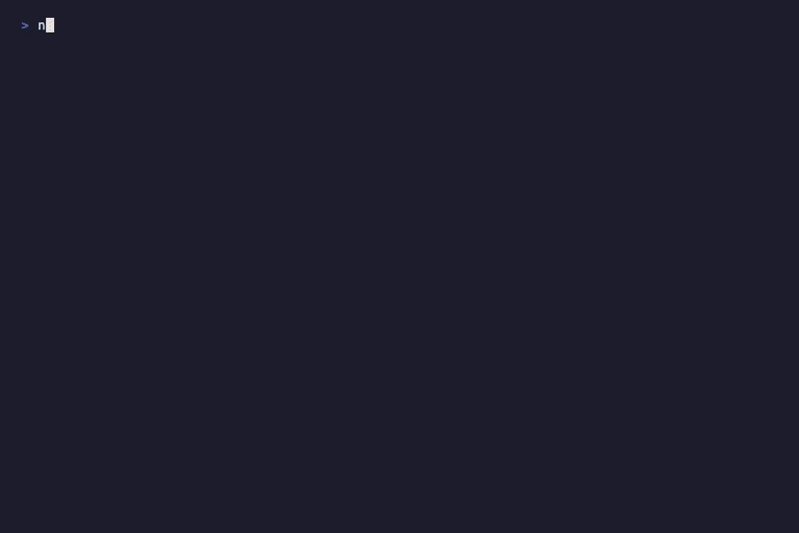
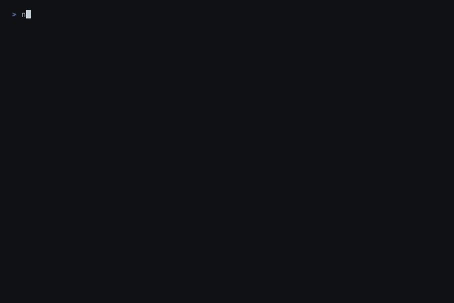

# claude-games

Play games in your terminal while Claude Code works on your tasks.



[](LICENSE)

Inspired by [claude-arcade](https://claude-arcade.lovable.app/)

---

## The Problem

You typed a big prompt. Claude is refactoring your auth module, migrating your database, or rewriting your test suite. The streaming dots are rolling. You have *nothing to do* for the next three minutes.

Every solution out there says "be productive while you wait." Open another tab. Review a PR. Read docs.

**claude-games** says: just take a break. Your code is shipping anyway.

## Install & Run

### Quick start (clone and run)

```bash
git clone https://github.com/tirth8205/claude-games.git
cd claude-games
npm install
npm run build
npm start
```

### Install globally (run from anywhere)

```bash
git clone https://github.com/tirth8205/claude-games.git
cd claude-games
npm install
npm run build
npm install -g .

# Now run from any terminal window:
claude-games
```

### Use with npx (once published to npm)

```bash
npx claude-games
```

> **Note:** `npx` usage requires the package to be published to npm first. For now, use the clone + build approach above.

### How to use alongside Claude Code

Open a **second terminal tab/pane** while Claude is working in the first one. Run `claude-games` in the second tab. Play games while Claude ships your code in the other tab. When you're done, close the game and switch back.

If you're inside a Claude Code session, you can also run it with:
```
! claude-games
```
(The `!` prefix runs a shell command in the current session's terminal.)

### Live agent status (optional but cool)

By default, the status bar shows a generic "claude is working..." message. To get **real-time updates** — know when Claude finishes or needs your input — run:

```bash
claude-games setup
```

This prints the Claude Code hook configuration you need. Add it to `.claude/settings.json` in your project (or `~/.claude/settings.json` globally). Once configured:

- **Green pulse** — Claude is actively using tools, working on your task
- **Yellow alert** — `>>> claude needs your input! <<<` — switch back, it's waiting for approval
- **Blue alert** — `>>> claude is done! switch back to review <<<` — your code is ready

The hooks write to a tiny temp file. The game polls it once per second. No network, no API calls, no tokens — just a file on disk.

## Games

### Claude Runner



The Claude sparkle mascot — the same `▐▛███▜▌` you see every time you launch Claude Code — now dodges real terminal errors in a side-scrolling runner.

- Jump over `Segfault`, `npm ERR!`, `panic!`, `exit code (1)`, git merge conflicts
- Duck under `▌FATAL▐`, `▌500▐`, `▌KILL▐` flying overhead
- `// TODO: fix later` and `// works on my machine` drift by in the background
- Speed ramps up as your score climbs
- Milestone flashes (`▜▛ nice!`) at every 100 points

### Snake — GitHub Contribution Graph Edition



The board is a grid that looks like GitHub's contribution heatmap. Your snake has a directional head (`▶▶` `▲▲` `▼▼` `◀◀`), solid `██` body that fades through GitHub's green gradient, and a `░░` tail. The food? Mini Claude sparkle logos (`▜▛`) pulsing in terracotta.

- Wrap-around edges — exit left, enter right
- Each food eaten = one "contribution"
- Speed increases every 5 points
- Subtle checkerboard grid for depth

## Features

### Agent Status Bar

Every screen shows a persistent status bar:

```
─────────────────────────────────────────────────────────
● claude is working...  ║  playing: 2m 14s  ║  esc to return
─────────────────────────────────────────────────────────
```

The green dot pulses like a heartbeat. The game timer ticks up so you know exactly how long you've been playing.

### Return Summary

When you exit, you get a little receipt:

```
☕ game over — you played for 3m 42s (snake: 47 pts)
```

### Session Achievements

Unlock fun milestones that flash briefly when achieved:

| Achievement | How to Unlock |
|-------------|---------------|
| **First bite** | Eat your first Claude logo in Snake |
| **Centurion** | Score 100 in Claude Runner |
| **Snaked it** | Reach snake length of 10 |
| **Speed demon** | Survive past 200 in Claude Runner |
| **Commit streak** | Eat 5 Claude logos without changing direction |

## How It Works

```
┌─────────────────┐         ┌──────────────────┐
│   Claude Code   │         │  claude-games   │
│   (tab 1)       │         │  (tab 2)         │
│                 │  hooks  │                  │
│  agent works... │ ──────> │  status file     │
│  tool calls...  │  write  │  (polls 1/sec)   │
│  done!          │         │                  │
│                 │         │  ● working...    │
│                 │         │  >>> done! <<<   │
└─────────────────┘         └──────────────────┘
```

1. You run `claude-games` in a separate terminal tab
2. Games render using [Ink](https://github.com/vadimdemedes/ink) (React for terminals) in an alternate screen buffer
3. All rendering is non-blocking — `setInterval` ticks, never synchronous loops
4. If hooks are configured, Claude Code writes status to a temp file on each tool use, completion, or notification
5. The game polls that file once per second and updates the status bar
6. When you exit, the return summary flashes, then the terminal is restored

**Zero network calls. Zero tokens. Pure local file + terminal rendering.**

## Controls

| Context | Key | Action |
|---------|-----|--------|
| Menu | `<- ->` or `1`/`2` | Select game |
| Menu | `Enter` or `Space` | Launch game |
| Menu | `Q` or `Esc` | Quit |
| Runner | `Space` or `Up` | Jump |
| Runner | `Down` | Duck |
| Runner | `Q` or `Esc` | Back to menu |
| Snake | Arrow keys or `WASD` | Move |
| Snake | `Q` or `Esc` | Back to menu |
| Game Over | `Space` | Restart |

## Project Structure

```
claude-games/
├── src/
│   ├── cli.ts               # CLI entry (claude-games / claude-games setup)
│   ├── index.ts              # Library entry (launchGames API)
│   ├── renderer.ts           # Alternate screen buffer management
│   ├── status-bridge.ts      # File-based IPC with Claude Code hooks
│   ├── status-bar.tsx        # Live agent status bar component
│   ├── utils.ts              # Colors, logo, scoring, timer, achievements
│   ├── menu.tsx              # Game selection menu
│   ├── snake.tsx             # Snake game
│   └── claude-runner.tsx     # Runner game
├── .claude-plugin/           # Claude Code plugin metadata
├── commands/games.md        # /games slash command definition
├── skills/games/SKILL.md     # Skill definition
└── dist/                     # Compiled output (npm run build)
```

## Contributing

Want to add a game?

1. Create a new `.tsx` file in `src/`
2. Export a React component with `{ onExit: () => void }` props
3. Use `useInput` from Ink for keyboard handling
4. Add `<StatusBar />` at the bottom
5. Add it to the menu in `src/menu.tsx`
6. PR it!

Ideas: Tetris, Pong, Minesweeper, 2048, Breakout...

## Credits

Inspired by [claude-arcade](https://claude-arcade.lovable.app/) — the original vision for games in Claude Code.

## License

[MIT](LICENSE)
